<!-- markdownlint-disable MD033 -->

<!---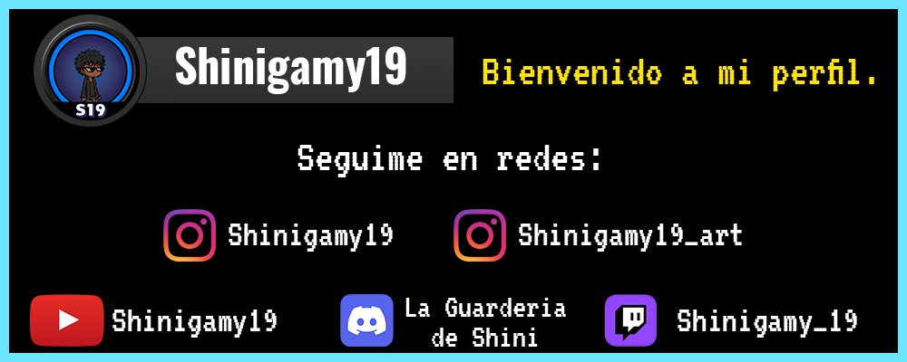 Para un futuro-->

<h1 align="center">Hola, Soy Shinigamy19!</h1>

<h3 align="center">Mis redes sociales:</h3>

<a href="https://kick.com/shinigamy19" target="_blank" rel="noopener noreferrer">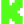</a>

  
<h2 align="left">Mis habilidades:</h2>

<h3 align="left">Lenguajes de Programación:</h3>

<a href="https://www.w3schools.com/cpp/" target="_blank" rel="noopener noreferrer"> 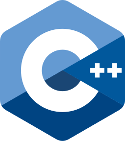 </a>

<a href="https://puredata.info/" target="_blank" rel="noopener noreferrer"> 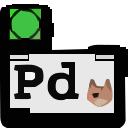 </a>

<h3 align="left">Frameworks / Librerías:</h3>

<a href="https://getbootstrap.com" target="_blank" rel="noopener noreferrer"> 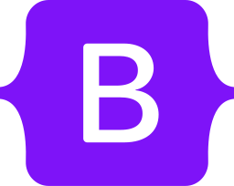 </a>

<a href="https://vuetifyjs.com/en/" target="_blank" rel="noopener noreferrer"> 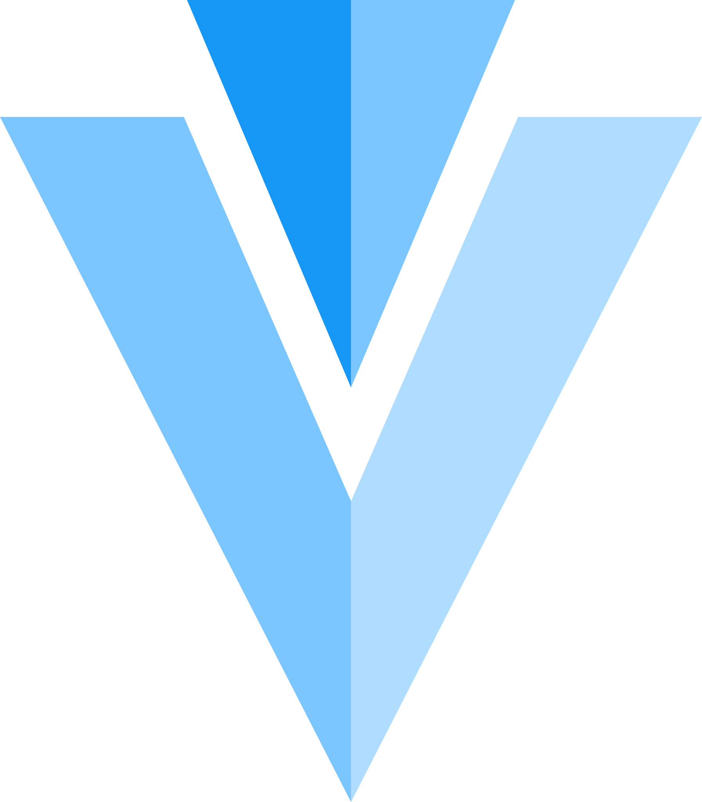 </a>
<a href="https://laravel.com/" target="_blank" rel="noopener noreferrer"> 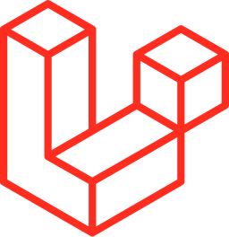 </a>

<a href="https://pugjs.org" target="_blank" rel="noopener noreferrer"> 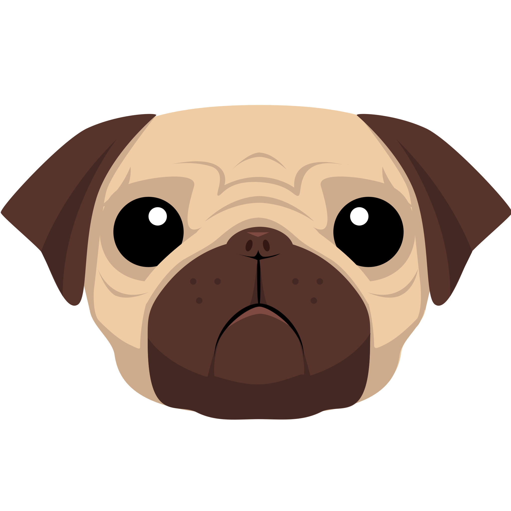 </a>

<h3 align="left">Bases de Datos:</h3>

<a href="https://www.mongodb.com/" target="_blank" rel="noopener noreferrer"> 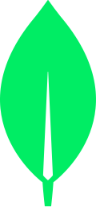 </a>

<a href="https://www.prisma.io/" target="_blank" rel="noopener noreferrer"> 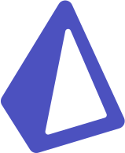 </a>

<h3 align="left">Desarrollo Móvil:</h3>

<a href="https://kotlinlang.org" target="_blank" rel="noopener noreferrer"> 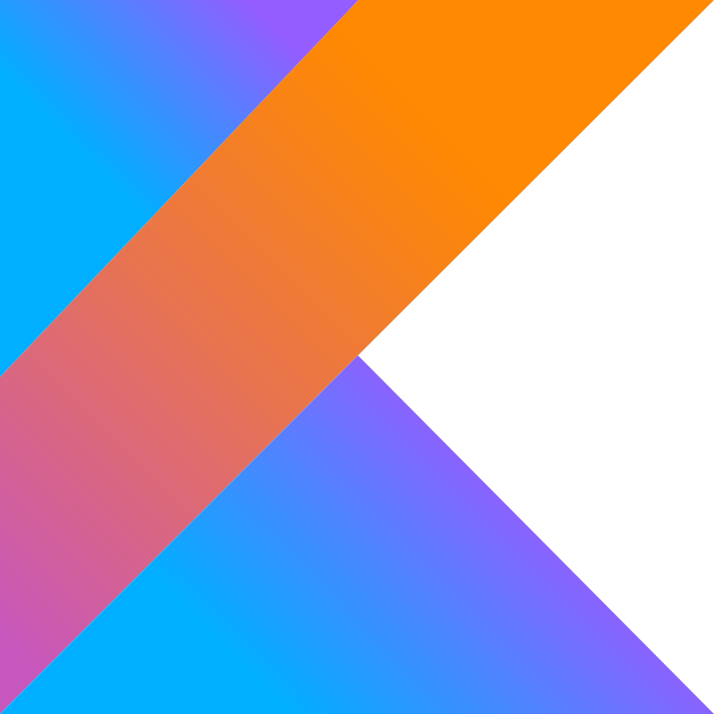 </a>

<h3 align="left">Motores de Juegos:</h3>

<h3 align="left">DevOps / Infraestructura / Automatización / APIs:</h3>

<a href="https://www.raspberrypi.com/software/" target="_blank" rel="noopener noreferrer"> 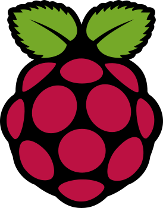 </a>

<a href="https://git-scm.com/" target="_blank" rel="noopener noreferrer"> 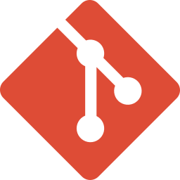 </a>

  

<h3 align="left">Diseño Multimedia / Herramientas / IDEs:</h3>

<a href="https://www.photoshop.com/en" target="_blank" rel="noopener noreferrer"> 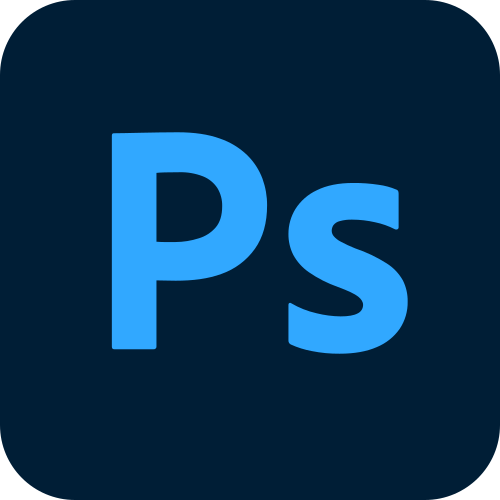 </a>

<a href="https://inkscape.org/es/" target="_blank" rel="noopener noreferrer"> 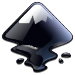 </a>
<a href="https://krita.org/es/" target="_blank" rel="noopener noreferrer"> 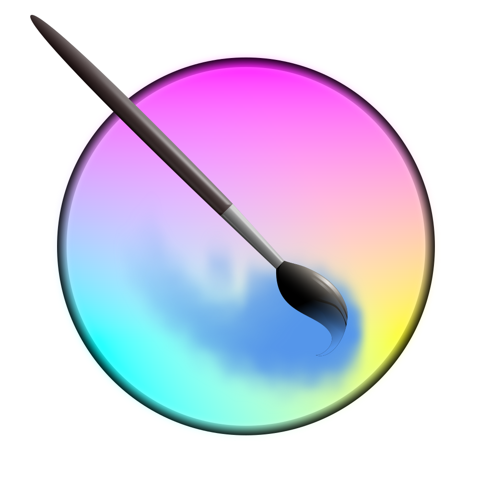 </a>

<a href="https://www.blender.org/" target="_blank" rel="noopener noreferrer"> 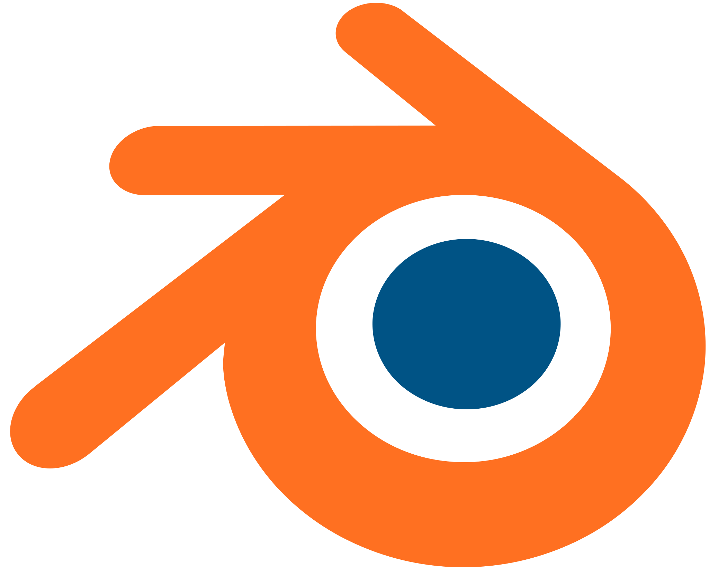 </a>

<a href="https://www.apachefriends.org/es/index.html" target="_blank" rel="noopener noreferrer"> 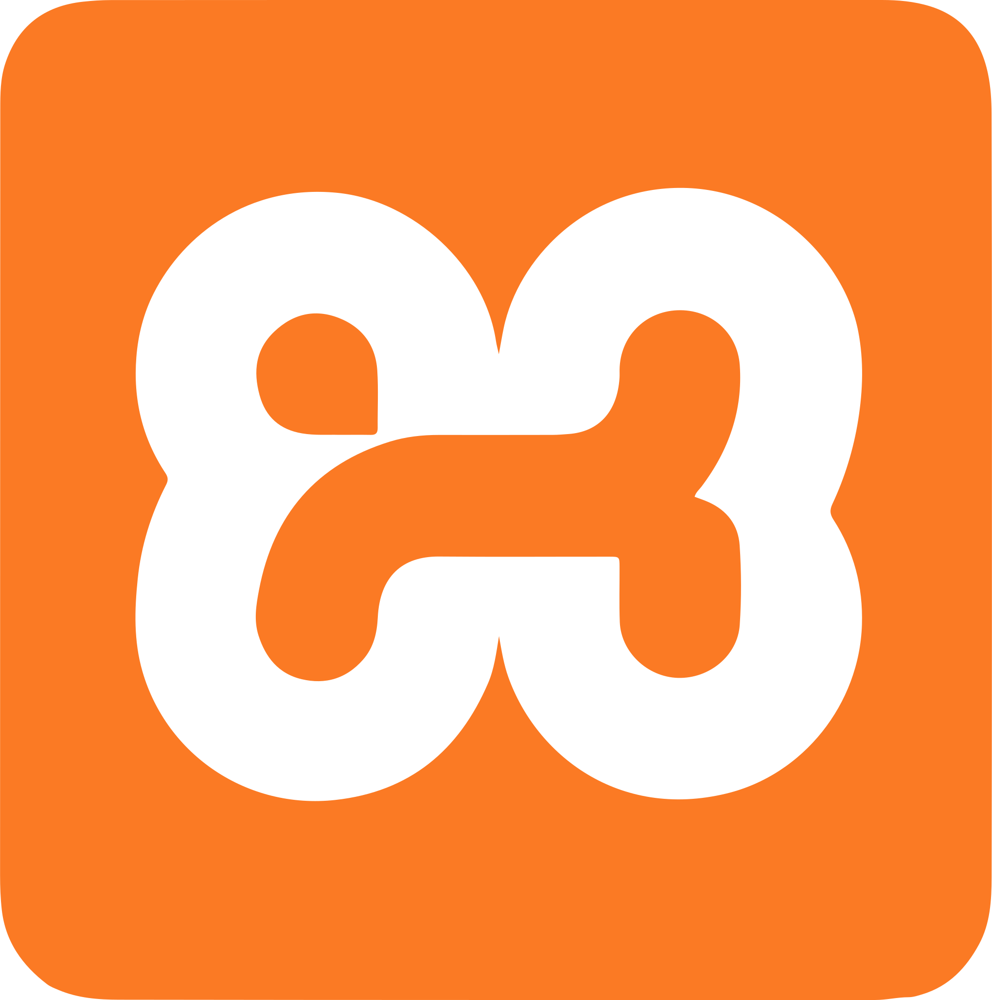 </a>

<a href="https://www.autodesk.com/products/autocad/overview" target="_blank" rel="noopener noreferrer"> 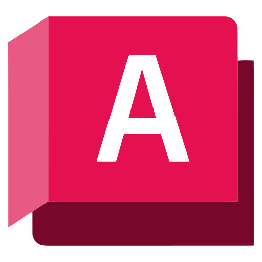 </a>
<a href="https://learn.microsoft.com/en-us/windows/powertoys/" target="_blank" rel="noopener noreferrer"> 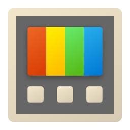 </a>
<a href="https://affinity.serif.com/" target="_blank" rel="noopener noreferrer"> 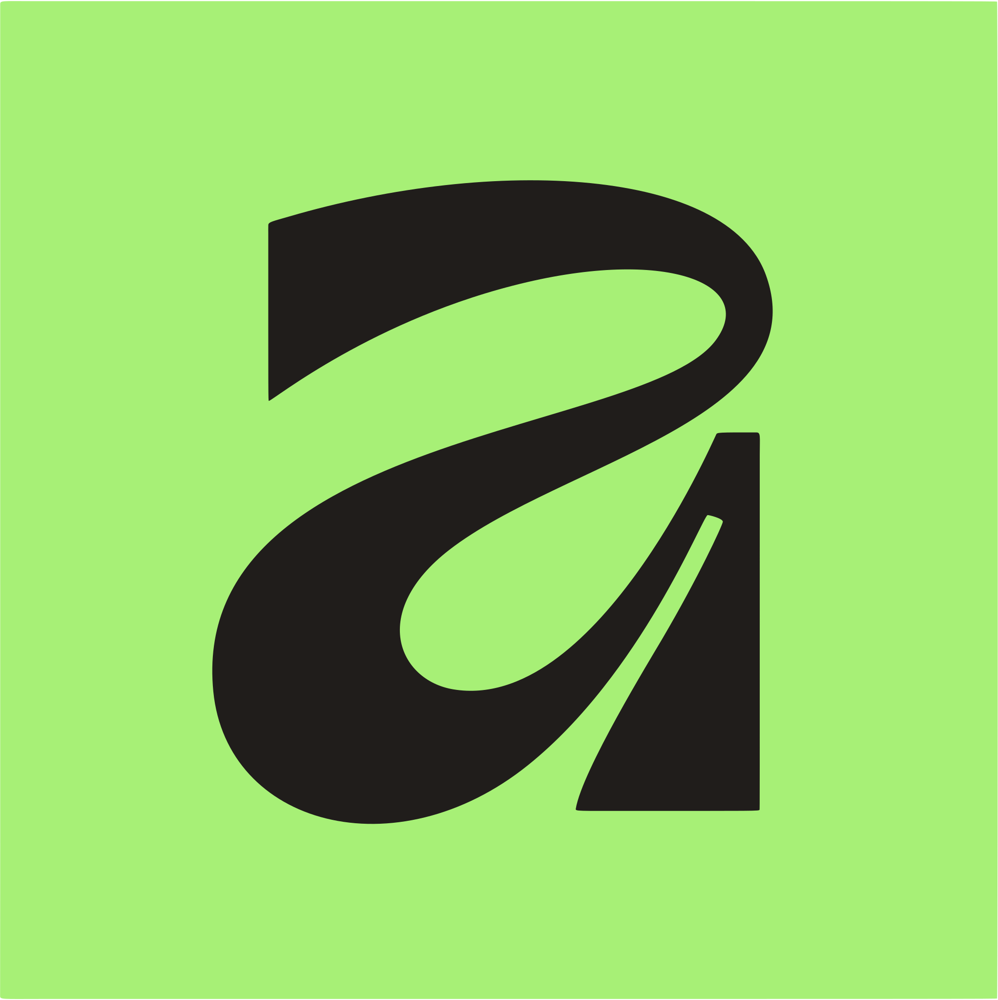 </a>

    
  

  

<h3 align="center">Donaciones:</h3>

###

<picture>
  <source media="(prefers-color-scheme: dark)" srcset="https://raw.githubusercontent.com/Shinigamy19/Shinigamy19/output/pacman-contribution-graph-dark.svg">
  <source media="(prefers-color-scheme: light)" srcset="https://raw.githubusercontent.com/Shinigamy19/Shinigamy19/output/pacman-contribution-graph.svg">
  
</picture>
