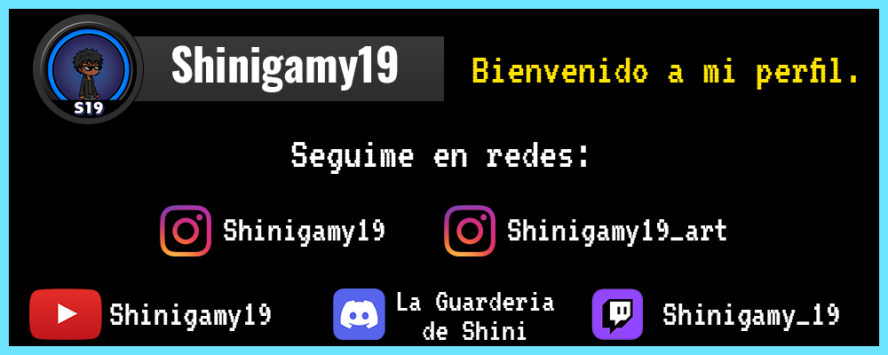

<!--- Para un futuro-->

<h1 align="center">Hola, Soy Shinigamy19!</h1>

<h3 align="center">Mis redes sociales:</h3>

  
<h2 align="left">Mis habilidades:</h2>

<h3 align="left">Front-End:</h3>

 

 
 
 
 
 
 
 
 
 
 

<h3 align="left">Back-End:</h3>

 
 
 
 

 

 

 
 

 
 
   
 
 
 
 

<h3 align="left">Otros Conocimientos:</h3>

 
 
 
 
 
 
 
 
 
 
  

 
 
 
 
 
 
 
 
 
 
 
 
 

<h3 align="left">Herramientas:</h3> 

 
 
 
 
 
 
 
 
 

 
 
 
 
 
 

  

&nbsp;

<h3 align="center">Donaciones:</h3>

